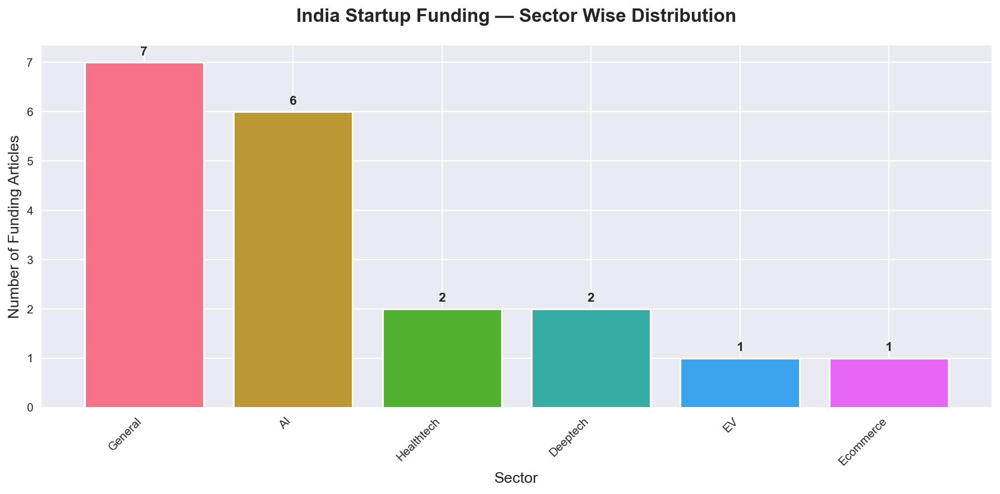

# 🇮🇳 India Startup Funding Trend Analyzer

A real-time data science project that scrapes, analyzes, and predicts 
India's startup funding trends using web scraping, NLP, and machine learning.



---

## 🚀 Live Features

- 🔍 **Real-time Web Scraping** — Automatically scrapes Inc42 for latest funding news
- 📰 **NewsAPI Integration** — Fetches from 1000+ news sources simultaneously  
- 🧠 **NLP Extraction** — Extracts company name, funding amount & sector using Regex
- 📊 **Interactive Dashboard** — Beautiful dark mode dashboard with Plotly + Dash
- 🔮 **ML Predictions** — Predicts which sectors will boom in 2026-27
- ⚙️ **Daily Automation** — Windows Task Scheduler runs scraper every day at 9 AM

---

## 🛠️ Tech Stack

| Category | Tools Used |
|----------|-----------|
| Language | Python 3.11.6 |
| Web Scraping | BeautifulSoup4, Requests |
| API | NewsAPI |
| NLP | Regex (re module) |
| Data Analysis | Pandas, NumPy |
| Visualization | Plotly, Matplotlib, Seaborn |
| Dashboard | Dash |
| ML/Prediction | Prophet, Scikit-learn |
| Automation | Windows Task Scheduler |

---

## 📁 Project Structure
india-startup-analyzer/

│

├── 📁 assets/                  # Generated charts

│   ├── sector_analysis.png

│   ├── amount_analysis.png

│   ├── source_analysis.png

│   └── predictions.png

│

├── 📁 data/                    # Collected data

│   └── inc42_articles.csv

│

├── 📁 notebooks/               # Jupyter notebooks

│

├── 📁 src/                     # Source code

│   ├── data_collector.py       # Web scraper + NewsAPI

│   ├── analyzer.py             # Data analysis + charts

│   └── predictor.py            # ML predictions

│

├── 📄 app.py                   # Interactive dashboard

├── 📄 requirements.txt         # Dependencies

├── 📄 run_collector.bat        # Daily automation script

└── 📄 .gitignore

---

## ⚙️ Installation

### 1. Clone the repository
```bash
git clone https://github.com/Vedikaa17/india-startup-analyzer.git
cd india-startup-analyzer
```

### 2. Create virtual environment
```bash
python -m venv venv
.\venv\Scripts\activate
```

### 3. Install dependencies
```bash
pip install -r requirements.txt
```

### 4. Setup API Key
Create a `.env` file in root folder:
Get your free API key from [NewsAPI.org](https://newsapi.org)

---

## 🏃 How to Run

### Step 1 — Collect Data
```bash
python src/data_collector.py
```

### Step 2 — Analyze Data
```bash
python src/analyzer.py
```

### Step 3 — Generate Predictions
```bash
python src/predictor.py
```

### Step 4 — Launch Dashboard
```bash
python app.py
```
Then open browser: `http://127.0.0.1:8050`

---

## 📊 Sample Output

### Sector Distribution
- 🤖 AI sector is the fastest growing in 2026
- 💊 Healthtech consistently receives funding
- ⚡ EV sector showing strong growth

### Predictions 2026-2027
- AI sector predicted to dominate with 5+ deals
- Deeptech emerging as next big sector
- Fintech showing signs of consolidation

---

## 🔄 Daily Automation

The scraper runs automatically every day at 9:00 AM using Windows Task Scheduler.
New funding articles are automatically appended to the dataset.

---

## 📈 Data Sources

| Source | Type | Articles/Day |
|--------|------|-------------|
| Inc42 | Web Scraping | 5-10 |
| NewsAPI | API | 20-30 |
| **Total** | **Combined** | **25-40** |

---

## 🎯 Skills Demonstrated

- ✅ Web Scraping with BeautifulSoup
- ✅ REST API Integration
- ✅ Natural Language Processing (NLP)
- ✅ Data Cleaning & Analysis
- ✅ Time Series Prediction
- ✅ Interactive Dashboard Development
- ✅ Automation & Scheduling
- ✅ Professional Project Structure

---

## 👩‍💻 Author

**Vedika Ramesh Welukar**  
Aspiring Data Scientist | India  

---

## 📄 License

This project is for educational purposes only.
Data scraped from public sources for learning.